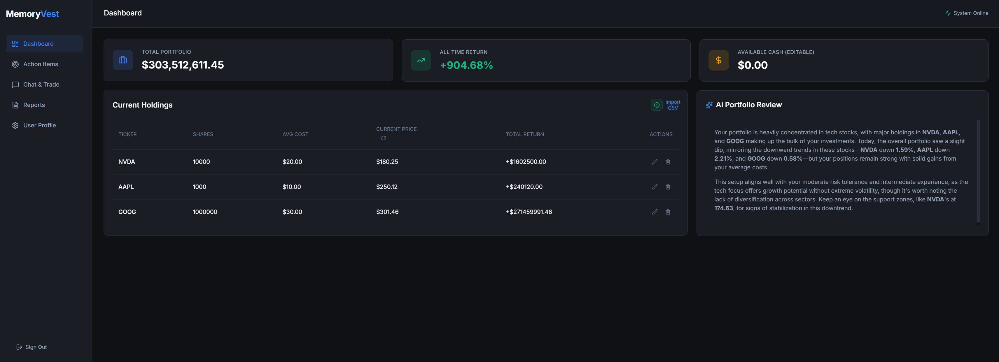

# MemoryVest

A Modern, Beginner-Friendly Investing Companion

MemoryVest is a full-stack investing companion that uses EverMemOS as its long-term memory layer to securely track your investment profile, portfolio holdings, and future interests. It features a modern React dashboard and a conversational AI assistant that automatically updates your portfolio and settings as you chat.

Try it here: https://memory-vest.onrender.com/
Video Demo link: https://youtu.be/L6c4SPGHCz4
## Features

- **Conversational Memory**: Uses an LLM agent with EverMemOS to dynamically learn your preferences, risk tolerance, and interests over time.
- **RESTful Backend API**: Modular FastAPI architecture (`/api/market`, `/api/profile`, `/api/chat`, `/api/portfolio`, `/api/reports`, `/api/action-items`) using SQLite for local data persistence.
- **React Web Dashboard**: Sleek, custom Vanilla CSS frontend (Vite) with a real-time Portfolio Dashboard, CSV drag-and-drop import, and responsive AI Chat UI.
- **Live Market Data**: Integrates with `yfinance` to hydrate the UI with real-time stock prices, return calculations, and support/resistance levels.
- **AI Daily Reports**: Generates beginner-friendly portfolio insights using LLMs (OpenRouter). Reports include portfolio performance, news summaries, technical watch levels, and a dedicated Action Items section. Reports are stored in SQLite, browsable in the dashboard, deletable, and remain generating even if you navigate away.
- **Action Items**: The AI monitors your past conversations and pending watch requests (from EverMemOS) and surfaces them as persistent, collapsible action items in the dashboard. New items are generated in the background and deduplicated semantically to avoid repetition. Each action item stores the date/time of the original request.
- **Report Chat Panel**: Each report has an embedded mini chat panel. The AI sends a personalized welcome message when you open a report and can answer questions about its content or accept feedback to tailor future reports. Feedback is automatically stored into EverMemOS.
- **News Integration**: Fetches live news headlines per ticker using `yfinance` (Alpha Vantage as fallback). Top 5 tickers are selected by EverMemOS conversation mention frequency, with absolute price change as a tiebreaker.
- **Email Delivery**: Sends formatted HTML report emails via SMTP (Gmail App Passwords supported).

---

## Getting Started

MemoryVest is composed of two layers: a FastAPI backend and a Vite+React frontend.

### 1. Configure Environment Variables

Copy `.env.template` to `.env` and fill in your keys:

```bash
cp .env.template .env
```

Key variables:

| Variable | Description |
|---|---|
| `EVERMEMOS_API_URL` | URL of your running EverMemOS instance |
| `OPENROUTER_API_KEY` | Required for all LLM features (reports, chat, action items) |
| `LLM_MODEL` | Model to use (e.g. `openai/gpt-4o-mini`) |
| `ALPHA_VANTAGE_API_KEY` | Optional — news fallback if yfinance returns no articles |
| `SMTP_*` | Optional — for email report delivery |

### 2. Initialize the Database

Run once from the project root to set up SQLite schemas:

```bash
uv run python -c "from app.infra.db import init_db; init_db()"
```

### 3. Start the Backend API Server

```bash
uv run uvicorn app.api.main:app --host 127.0.0.1 --port 8000 --reload
```

### 4. Start the Web Dashboard

```bash
cd frontend
npm install
npm run dev
```

Visit the URL provided by Vite (usually `http://localhost:5173`).

---

## Chat & Portfolio Setup

The core experience is a natural language assistant. The AI parses your messages, responds conversationally, and automatically updates your profile, portfolio, and cash balance.

### Chat Examples

- **Profile setup**: *"I'm a beginner investor with low risk tolerance. Keep explanations simple."*
- **Set email**: *"My email is me@example.com."*
- **Add holdings**: *"I bought 15 shares of Apple at $168.50."*
- **Set cash**: *"I have $3,500 ready to invest."*
- **Track intents**: *"Watch AMD for me and alert me if it dips below $135."*
- **Iran conflict monitoring**: *"Keep a close eye on the Iran conflict and how it affects my tech holdings."*

---

## Action Items

Action Items are AI-generated monitoring tasks derived from your past conversations and watch requests stored in EverMemOS.

- **Persistent**: Stored in SQLite so they survive page refreshes and server restarts.
- **Background generation**: New items load while you browse other sections.
- **Semantic deduplication**: The AI compares new directives against existing item titles so similar requests don't produce duplicate cards.
- **Collapsible cards**: Each item shows a concise title and timestamp. Click to expand for a detailed analysis of the current status.
- **Dismiss**: Click ✕ on any card to remove it.

---

## Reports

Reports are AI-authored portfolio insights generated on demand.

- **Generate**: Click the ✨ button in the Report History sidebar. Report generation continues in the background if you navigate away.
- **Delete**: Hover over any report in the sidebar and click the 🗑 icon.
- **Action Item Section**: Each report includes a dedicated `🎯 Action Item Updates` section addressing every active action item with current market data.
- **News**: Sourced per-ticker individually (not combined) to ensure relevant headlines appear. Tickers are ranked by how often they appear in your EverMemOS conversation history.
- **Report Chat**: Open any report and use the mini chat panel at the bottom to ask questions about the report or give feedback. The AI has full context of the report and stores your feedback in EverMemOS to influence future reports.

---

## Legacy CLI Operations

```bash
# List all stored user IDs
uv run memoryvest --list-users

# Start an interactive CLI chat session
uv run memoryvest chat --user-id anon

# Generate a preview of the daily report
uv run memoryvest report preview --user-id anon

# Send email report (requires SMTP .env variables)
uv run memoryvest report send --user-id anon
```

Append `--verbose` or `-v` to any command to enable trace logging.
